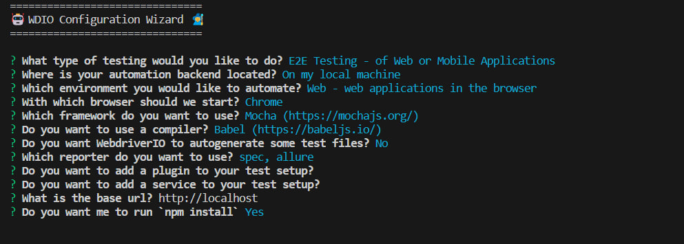

# End to End API Automation using Webdriver.io - Axios - Chai expect

## API

- **API**: BOOKSTORE API in Swagger
- **Link**: https://bookstore.toolsqa.com/swagger/


## API list to test

1. **POST:** /BookStore/v1/Books
2. **DELETE:** /BookStore/v1/Books

## Requirement

- [Node.js](https://nodejs.org/) .

## How to create new project for API testing 
1. Open terminal and execute 
```
npm init wdio .
```

2. Setup project



3. install dependencies

```
npm install axios
```

```
npm install chai 
```

4. Update wdio.conf.js

- update capabilities chromedriver to headless mode
```
capabilities: [{
        browserName: 'chrome',
        'goog:chromeOptions': {
            args: ['headless', 'disable-gpu']
        }
    }],
```

- update specs path 
```
specs: [
        './test/specs/**/*.js'
    ],
```

- update logLevel (optional)
```
logLevel: 'silent',
```

- update baseURL (comment, we'll use .env to save the base URL)
```
// baseUrl: 'http://localhost',
```

5. Update package.json 
- update type to commonjs
```
 "type": "commonjs",
```

- update scripts, add allure command
```
"report": "allure generate allure-results --clean && allure open"
```


## Getting Started

Follow these steps to get started with the project:

1. Clone this repository to your local machine:

```
git clone <repository_url>
```
2. Change into directory project:

```
cd <project_directory>
```

3. Install project dependencies using npm:

```
npm install
```

4. Create .env files

create .env files and variables to use in the project

## Running the Tests
To run the tests, follow these steps:

1. Run the WebdriverIO tests:

```
npm run wdio
```

2. Generate a test report using the Allure command:

```
npm run report
```
